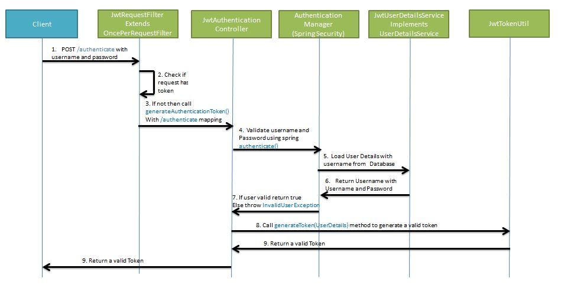
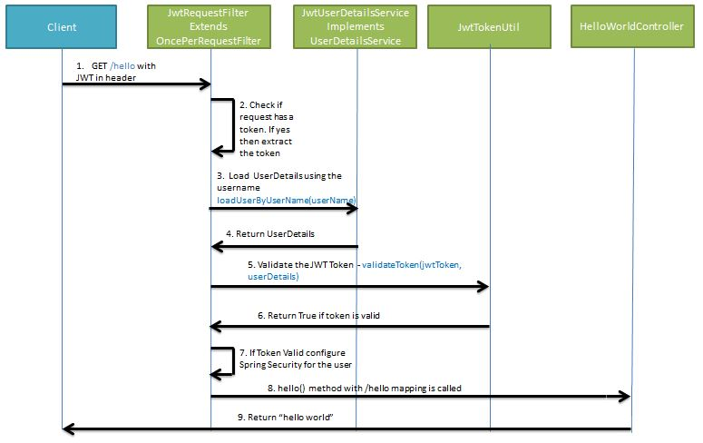

#Spring Security and JWT Configuration

We will be configuring Spring Security and JWT for performing 2 operations

- Generating JWT 
  (Expose a POST API with mapping /authenticate. 
  On passing correct username and password it will generate a JSON Web Token(JWT))
  
- Validating JWT 
  (If user tries to access GET API with mapping /hello. It will allow access 
  only if request has a valid JSON Web Token(JWT))
  
##Generating JWT

##Validating JWT
